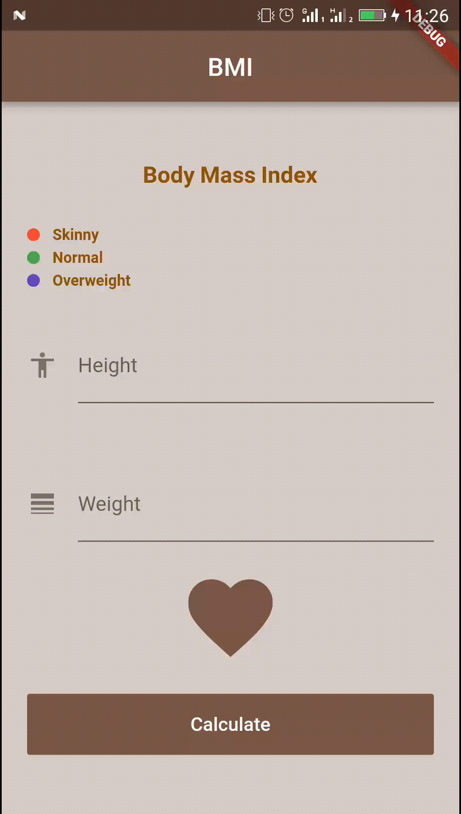

# Flutter Study Jam - Code Lab

----------

## Body Mass Index ( BMI ) Mobile Application

### Description
Mobile application to calculate the Body Mass Index BMI
Created using Flutter as a part of the Flutter Study Jam - Code Lab,
held in Google Developers Group chapter of Ghardaia - Algeria
> Made by : Elbez Hammouda

### Getting Started
1. Setup Flutter ( [check here ](https://flutter.io/get-started/install/))

2. Download this source code.

3. Enjoy !!

### Resources
For help getting started with Flutter, you can check those resources
- [Official documentation](https://flutter.io/).

- [Start Flutter](https://startflutter.com/).

- [Flutter at Gitter](https://gitter.im/flutter/flutter).

- [Flutter packages](https://pub.dartlang.org/flutter).

- [Awesome Flutter github repo](https://github.com/Solido/awesome-flutter).

